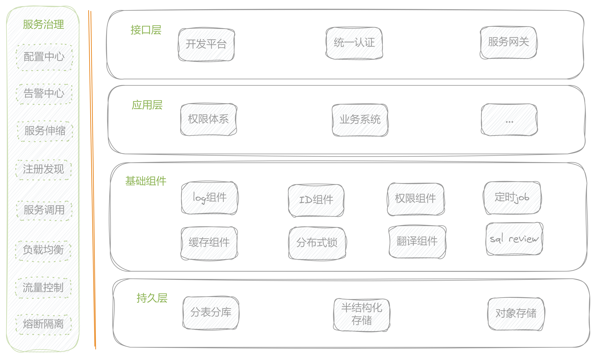

# 登录认证

登录、退出相关接口

---

### 1、登录
- 接口
``` api
	/uac/login
```
- 返回
``` js
	{
		"code": 0,
		"message": "操作成功",
		"data": "7088064b1bd44998ab5d4b5d47edd786" // token
	}
```
- 错误码


--- 
### 架构图
<div align="center">
    
</div>

### 2、当前用户修改资料
- 接口
``` api
	/uac/login
```
- 参数
``` p 
	{String}	account = ""			账号
	{String}	pd = ""			        密码
	{int}		sex = 1					性别
	{String}	phone = ""				联系电话
	{String}	introduce = ""			个人介绍
```
- 返回 
@import(res)


--- 
### 3、根据旧密码修改新密码
- 接口：
``` api
	/SysUser/updatePassword
```
- 参数: 
``` p
	{String}	old_pwd		旧密码
	{String}	new_pwd		新密码
```
- 返回 
@import(res)

--- 
### 4、直接修改新密码
- 接口
``` api
	/SysUser/updatePassword2
```
- 参数
``` p
	{String}	new_pwd		新密码
```
- 返回 
@import(res)


